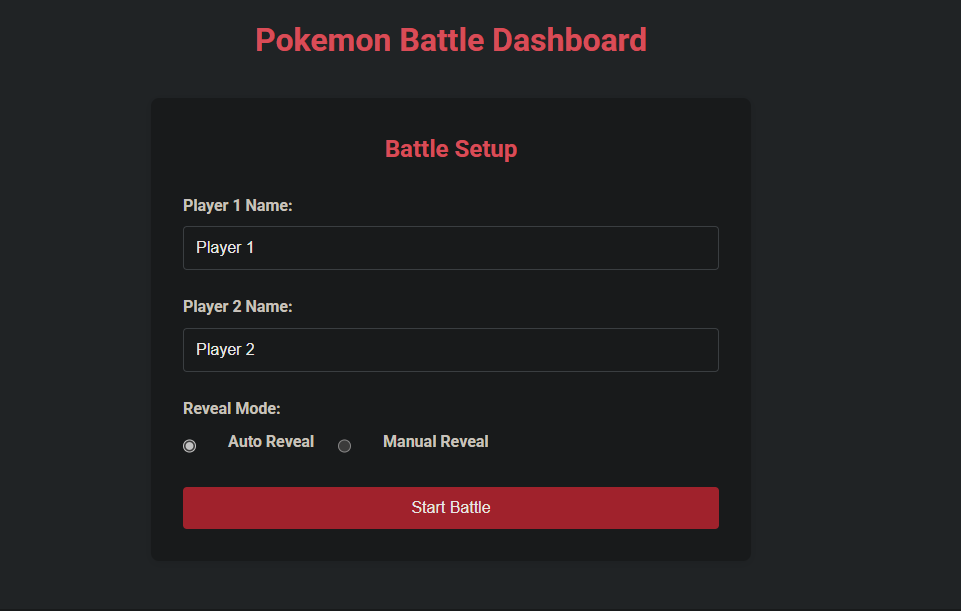
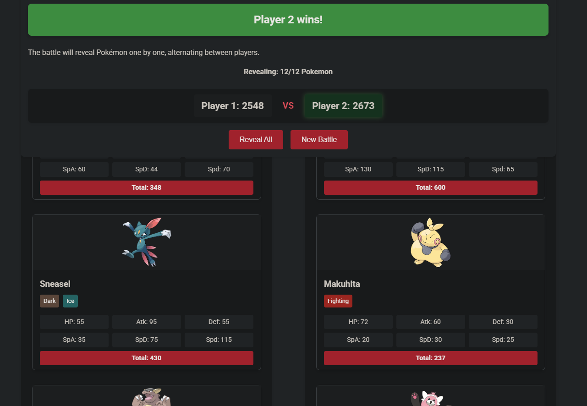

# Pokemon Battle Dashboard

A web application that automates Pokemon battles between two players, with dramatic revealing of Pokemon and stat calculations.

## Features

- 🎮 **Random Pokemon Generation**: Automatically generates 6 random Pokemon for each player
- 👥 **Player Names**: Custom names for each player
- 🎭 **Dramatic Reveals**: Two reveal modes - automatic or manual, one Pokemon at a time
- 📊 **Live Score Tracking**: Real-time score updates as Pokemon are revealed
- 📱 **Responsive Design**: Works on desktop and mobile devices
- 🏆 **Battle History**: Tracks win/loss records between players

## Screenshots

### Setup Screen


### Battle in Progress


## How It Works

The application uses the [PokeAPI](https://pokeapi.co/) to fetch random Pokemon data. For each player, 6 Pokemon are randomly selected, and their total stats are calculated. The player with the highest total stat score wins the battle.

During the reveal process, Pokemon are shown one at a time, alternating between players, building suspense as the scores change.

## Installation

1. Clone this repository:
```bash
git clone <your-repo-url>
cd Pokemon_battle_mel
```

2. Create a virtual environment and activate it:
```bash
python -m venv venv
source venv/bin/activate  # On Windows: venv\Scripts\activate
```

3. Install dependencies:
```bash
pip install -r requirements.txt
```

4. Run the application:
```bash
python app.py
```

5. Access the dashboard at `http://localhost:5000`

## Project Structure

Pokemon_battle_mel/
├── app.py                # Flask application entry point
├── pokemon_service.py    # Service for Pokemon data retrieval
├── requirements.txt      # Python dependencies
├── render.yaml           # Render deployment configuration
├── README.md             # This file
├── static/               # Static assets
│   ├── css/              # CSS styles
│   │   └── style.css     
│   └── js/               # JavaScript files
│       └── script.js     
├── templates/            # HTML templates
│   └── index.html        # Main page template
└── screenshots/          # Screenshots for README
    ├── dashboard.png
    ├── setup.png
    ├── battle.png
    └── winner.png